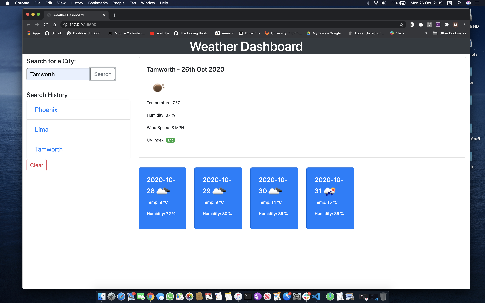
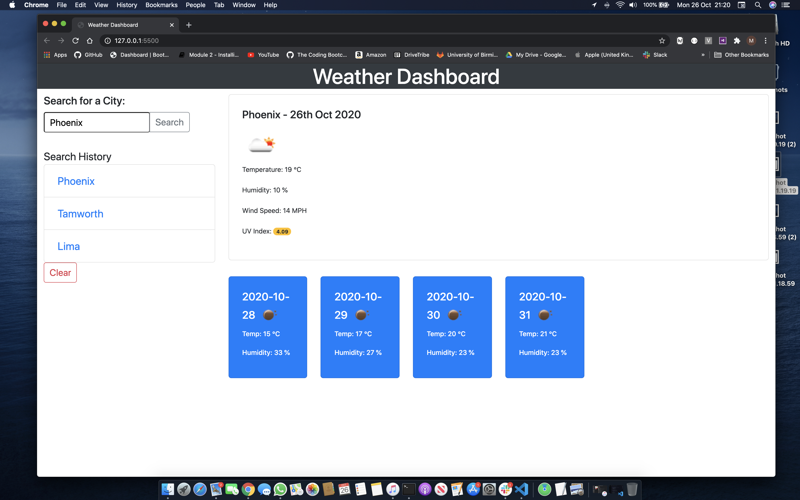
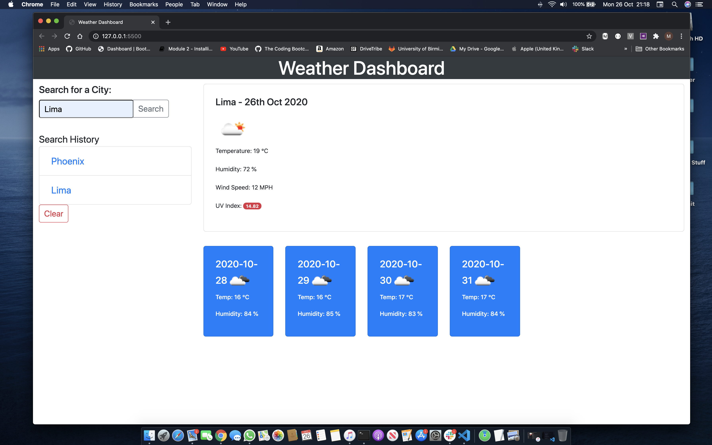

# Weather Dashboard Application.

## Objective.
---
To create a dynamically functioning weather application. 

When a user searches for a City, the application must:
* Present current and future conditions for that City.
* Show a UV index with colours that dynamically update depending on the current UV index (low/moderate/severe).
* Have dynamically updated icons representing current and future weather conditions.
* Show a 5-day forecast.
* Show a display of recent history.
* Upon opening the application, the last searched city forecast must be shown.

## Application Website.
---
The application can be accessed by following: https://markleonard84.github.io/weather-dashboard/

## Images
---

The images show examples of different searches and corresponding weather forecasts. I chose 3 locations with differing UV Indicies to demonstrate the colour change of the indicator.

The application was built using:

* Visual Studio Code
* OpenWeather api - https://openweathermap.org
* Bootstrap 
* Moment.js
* JQuery

